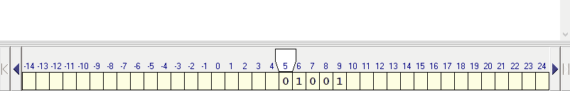

# Алгоритм для машины Тьюринга

## Задание.
На ленте машины Тьюринга содержится последовательность 0 и 1. Обратить слово из 0 и 1 (т.е. на выходе буквы слова будут в обратном порядке).

## Решение

### Таблица переходов

### Пример решения

